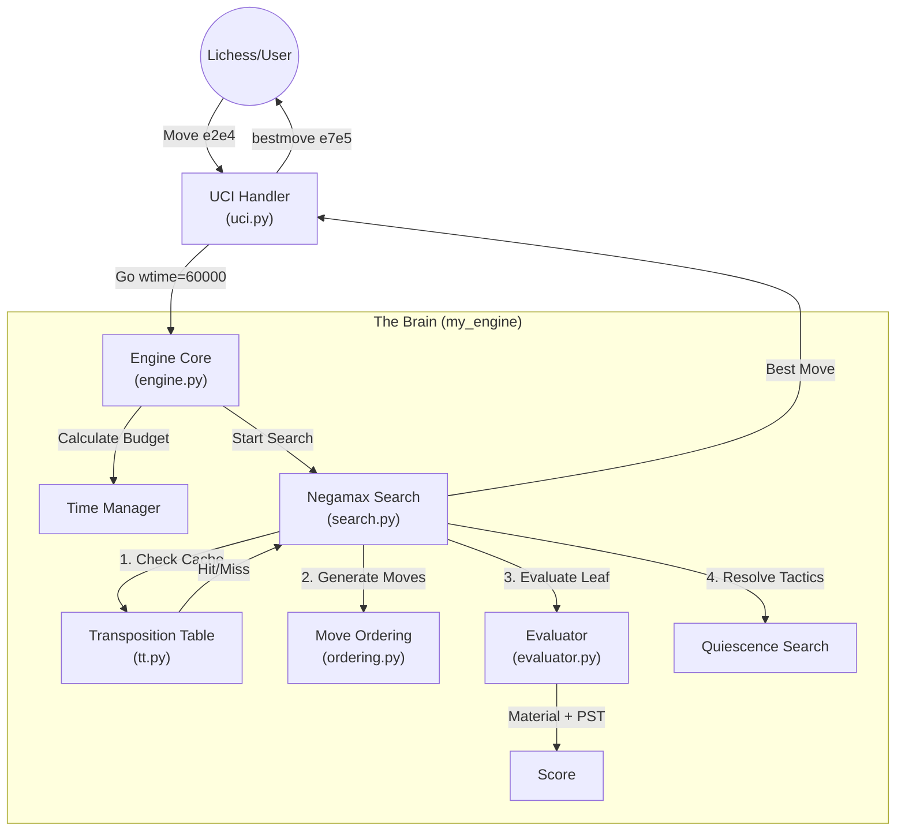

<div align="center">

# 🧠 AI Chess Engine (Custom Implementation)
### A Python-based Chess AI from Scratch


</div>

## 🚀 How to Run

To start the bot and connect it to Lichess:

```bash
python lichess-bot.py
```

To run **engine tests** or benchmarks separately (verify logic without connecting to Lichess):

```bash
# Run the UCI engine in test mode
python engines/my_engine/run_engine.py
```

---

## 📖 Overview

This project implements a **custom chess engine** (`engines/my_engine`) capable of playing at a decent club level (~1500 Elo). Unlike simple random movers, this engine uses advanced **Game Theory** and **Search Algorithms** to "think" ahead.

It is integrated into `lichess-bot` to play against humans and other bots online.

### Key Features
- **Smart Search**: Uses **Negamax** with **Alpha-Beta Pruning** to search millions of positions.
- **Memory**: Implements a **Transposition Table** to remember positions it has already seen.
- **Tactical Awareness**: Uses **Quiescence Search** to avoid making blunders in complex exchange variations.
- **Evaluation**: "Tapered" evaluation that understands the difference between opening, middlegame, and endgame.

---

## 🏗️ Architecture (How it Works)

The engine follows a classical pipeline architecture. Here is the flow of data when the bot decides on a move:



---

## 🏎️ The "Game Flow" (How it Thinks)

Here is a step-by-step narrative of what happens when the engine makes **one single move**:

### Step 1: The Request
-   **Lichess** sends a command: `position startpos moves e2e4`. "The game just started, opponent played King's Pawn."
-   **Lichess** says: `go wtime 300000 btime 300000`. "You have 5 minutes. Go!"

### Step 2: Time Management
-   **Engine** thinks: "I have 5 minutes. The game will likely last 40 more moves. I should spend about **4.5 seconds** on this move (60% of remaining time / 40)."
-   It sets a **Stop Watch**: "If I haven't found a move in 4.5 seconds, I will stop."

### Step 3: Iterative Deepening (The "Anytime" Algorithm)
The engine doesn't just dive deep instantly. It searches in layers:
1.  **Depth 1**: checks all legal moves. Says "Nf3 looks best." (Took 0.001s).
2.  **Depth 2**: checks opponent's replies. Says "Nf3 is still best." (Took 0.01s).
3.  **Depth 3**: checks my replies to them.
4.  ...
5.  **Depth 6**: "Wait! If I play Nf3, he plays ...d5 later and attacks me in a way I didn't see at Depth 1."

### Step 4: The Search (Alpha-Beta)
Inside the search, the engine is looking at thousands of positions.
-   It reaches a position it saw 2 seconds ago.
-   **Transposition Table**: "Hey! I remember this hash (Zobrist Key). It was bad for White."
-   **Result**: It skips analyzing it again (Instant lookup!).

### Step 5: The Move
-   Time is up (4.5s elapsed).
-   The engine returns the best move found at the deepest completed depth.
-   **UCI**: outputs `bestmove g1f3`.

---

## 📂 Codebase Tour (Detailed)

Here is exactly how the engine is built, file by file:

### 1. The Core Logic
- **`search.py`**: This is the engine's capability to "think".
    - **What it does**: It doesn't just look at the current board; it simulates what *might* happen 4-6 moves in the future.
    - **Key Function**: `search_root()` starts the process, calling `negamax()` recursively.
- **`evaluator.py`**: The engine's judgment.
    - **What it does**: It looks at a static board (no future moves) and assigns a score.
    - **Logic**: S = (Material) + (Position Bonuses) + (Pawn Structure).
    - **Example**: A Knight in the center is worth +3.2 (300 for Knight + 20 for position). A Knight in the corner is +2.9.
- **`tt.py`** (Transposition Table):
    - **What it does**: It's a `dict` (Hash Map) that saves every position the engine analyzes.
    - **Data**: Stores `{Hash: 12345, Score: +50, BestMove: e2e4, Depth: 4}`.

### 2. The Support Systems
- **`ordering.py`**: The "Assistant" that sorts moves.
    - **Why?**: The standard search is lazy. It checks the first move on the list. If the first move is bad, it wastes time.
    - **How**: It puts **Captures** and **Promotions** at the top of the list.
- **`engine.py`**: The "Manager".
    - **Responsibility**: It decides *when* to stop thinking. It calculates "I have 5 minutes left, so I can spend 5 seconds on this move."
- **`uci.py`**: The "Mouthpiece".
    - **Function**: It translates internal Python objects (like `chess.Move`) into text commands (like `bestmove e2e4`) that Lichess understands.

---

## 🧠 Algorithms Explained (In-Depth)

### 1. Alpha-Beta Pruning: The "Refutation" Logic
Instead of checking every single move, we use logic to "prune" (cut off) bad branches.
-   **Scenario**: You are analyzing a move, say `Re1`.
-   **Discovery**: You find that if you play `Re1`, your opponent has a reply `...Qxe1#` (Checkmate).
-   **The Pruning**: You immediately **stop** analyzing `Re1`. You don't need to check "What if he doesn't take my Rook?". The fact that he *can* checkmate you is enough to prove `Re1` is a terrible move.
-   **Result**: We saved time by not checking thousands of other silly variations after `Re1`.

### 2. Quiescence Search: The "Exchange Resolver"
One of the most dangerous bugs in chess engines is the **Horizon Effect**.
-   **Scenario**: The engine searches 4 moves deep.
    -   Move 1: White takes Pawn (+1).
    -   Move 2: Black takes Pawn (0).
    -   Move 3: White takes Bishop (+3).
    -   Move 4: *Depth Limit Reached*. Engine says: "I am winning by +3!"
-   **Reality**: On Move 5, Black captures White's Queen (-9).
-   **Fix**: Quiescence Search triggers at the depth limit. It says: *"Is there a capture possible? If yes, keep searching ONLY captures."* It would see Move 5 and realize the position is actually losing.

### 3. MVV-LVA (Move Ordering)
How do we sort captures to check the best ones first? We use **Most Valuable Victim - Least Valuable Attacker**.
-   **Logic**: Use a cheap piece to capture an expensive piece.
-   **Examples**:
    1.  **Pawn takes Queen (PxQ)**: Best! (Gain 9, Risk 1).
    2.  **Knight takes Rook (NxR)**: Good. (Gain 5, Risk 3).
    3.  **Queen takes Pawn (QxP)**: Bad/Risky. (Gain 1, Risk 9).
-   **Why?**: Checking `PxQ` first leads to a "cutoff" faster than checking `QxP`.

### 4. Transposition Table: The "Memory"
Why do we need to "remember" positions?
-   **Transpositions**: In chess, you can reach the exact same position via different move orders.
    -   Path A: `1. e4 e5 2. Nf3 Nc6`
    -   Path B: `1. Nf3 Nc6 2. e4 e5`
-   **The Problem**: Searching the same position twice is a huge waste of time.
-   **The Solution**: When we finish analyzing a position, we save the result (Score + Best Move) in the **Transposition Table**. If we encounter this position again (via a different path), we instantly retrieve the saved score. This effectively doubles or triples our search depth.

---

## ⚖️ Evaluation Strategy (`evaluator.py`)

The engine evaluates positions based on a **Tapered Eval**: it knows the game changes as pieces are traded.

1.  **Material**: Queens are worth more than Rooks (900 vs 500).
2.  **Piece-Square Tables (PST)**: Knights are bad on edges (-50) but good in the center (+20).
3.  **Phase**:
    - **Opening/Middlegame**: Focus on King Safety and Development.
    - **Endgame**: Focus on pushing Pawns and activating the King.
    - The engine smoothly blends these scores based on how many pieces are left.

---

## ⚙️ Configuration

You can tweak the engine in `engines/my_engine/config.yaml`:

```yaml
engine:
  tt_mb: 128        # Size of memory (MB). Higher = Smarter but uses RAM.
  max_depth: 6      # How many moves ahead to think.
  time_ms: 1000     # Fixed time per move (if not playing with a clock).
```

---

## 🤔 Key Algorithm Choices

### Why Negamax?
I chose **Negamax** over the standard Minimax because it simplifies the code.
-   **Reason**: In Minimax, you need separate logic for White (maximize score) and Black (minimize score). Negamax uses the mathematical property `max(a, b) == -min(-a, -b)` to handle both players with a single function. This reduces code duplication and potential bugs.

### Why Alpha-Beta Pruning?
Standard Minimax is too slow for chess (searching 6 moves deep would take years).
-   **Reason**: Alpha-Beta allows the engine to mathematically prove that certain moves are "bad" without searching them fully. This "pruning" increases search speed by 10x-100x, allowing the engine to see much further ahead in the same amount of time.

### Why Transposition Tables?
Chess often reaches the same position via different move orders (transpositions).
-   **Reason**: Without a table, the engine wastes time re-calculating identical positions. By caching results in a Hash Map (using Zobrist Hashing), the engine can instantly recall previous evaluations. This is critical for reaching competitive depths (6+ ply).

### Why Iterative Deepening?
Instead of searching directly to depth 6, the engine searches depth 1, then 2, then 3...
-   **Reason**: It makes the engine "time-aware". If we have 1 second left, we can return the best move from the last completed depth (e.g., Depth 5). Without this, we might run out of time halfway through Depth 6 and have no move ready.